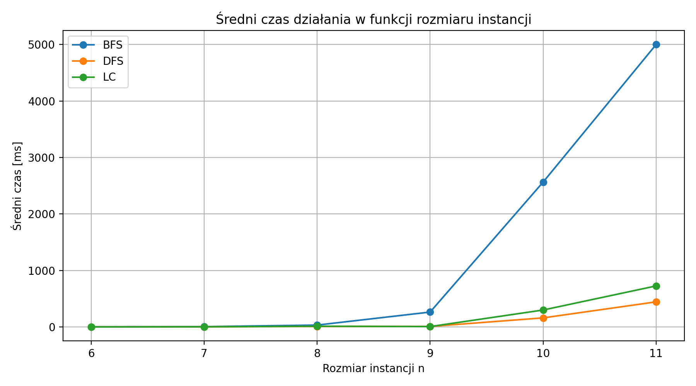
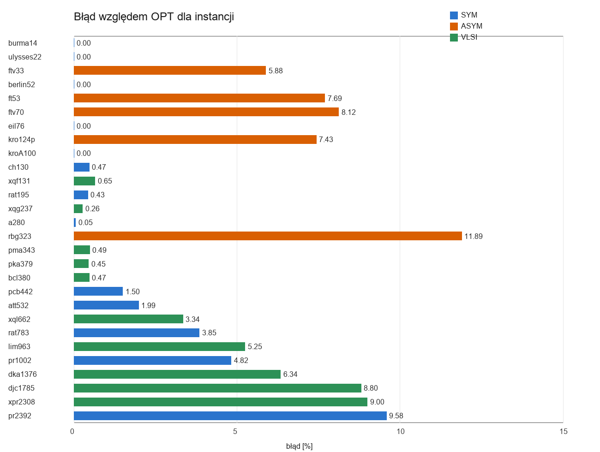

# TSP Algorithms Benchmark

A four-stage academic project for the **Design of Efficient Algorithms** course. The repository compares exact methods, classical heuristics and metaheuristics for the Traveling Salesman Problem (**TSP**) and its asymmetric variant (**ATSP**).

The project was developed incrementally: each stage introduces a different approach, configuration files, benchmark datasets, CSV result exports and visual analysis.

## Implemented methods

| Stage | Method | Language | Main purpose |
|---|---|---|---|
| 1 | Brute force, RAND, Nearest Neighbour (NN), Repetitive Nearest Neighbour (RNN) | Python | Compare exact enumeration with basic heuristics |
| 2 | Branch and Bound with BFS, DFS and Least Cost (LC) strategies | Python | Measure pruning efficiency, runtime and memory usage |
| 3 | Simulated Annealing with nearest-neighbour initialization and 2-opt neighbourhood | C++20 | Evaluate a metaheuristic for TSP and ATSP |
| 4 | Genetic Algorithm with OX crossover, mutation, elitism and local improvement | C++17 | Benchmark a hybrid GA on TSPLIB, ATSP and VLSI instances |

## Repository structure

```text
tsp-algorithms-benchmark/
├── task1-bruteforce-heuristics/
├── task2-branch-and-bound/
├── task3-simulated-annealing/
├── task4-genetic-algorithm/
├── docs/
│   ├── plots/
│   └── reports/
├── .gitignore
├── requirements.txt
└── README.md
```

## Selected results

### Task 1: brute force and classical heuristics

The brute-force approach guarantees an optimal solution but becomes impractical very quickly. In the benchmark, the configured 5-second timeout was reached consistently from `n = 11`. NN provided the fastest practical baseline, while RNN improved solution quality at the cost of additional runtime.


### Task 2: Branch and Bound

The three Branch and Bound variants use different OPEN structures: FIFO queue for BFS, LIFO stack for DFS and a priority queue ordered by lower bound for LC. The benchmark measures runtime, generated and expanded nodes, pruning and the maximum OPEN size.



### Task 3: Simulated Annealing

The Simulated Annealing implementation supports symmetric and asymmetric instances. It starts from a nearest-neighbour route and explores the search space using 2-opt moves. Small generated instances can be evaluated against an exact Held-Karp reference.


### Task 4: Genetic Algorithm

The final stage implements a configurable hybrid Genetic Algorithm. It uses permutation-based routes, tournament selection, OX crossover, multiple mutation operators, elitism and local improvement. Experiments cover TSPLIB TSP, TSPLIB ATSP and Waterloo VLSI instances.



## Running the programs

Each stage is self-contained. Run commands from the selected stage directory.

### Task 1

```bash
cd task1-bruteforce-heuristics
python3 tsp_task1.py config_bruteforce.txt
python3 tsp_task1.py config_heuristics.txt
```

### Task 2

```bash
cd task2-branch-and-bound
python3 task2_bnb_tsp.py config.txt
python3 batch_task2.py batch_config.txt
```

Optional plot regeneration:

```bash
pip install -r ../requirements.txt
python3 plot_task2.py
```

### Task 3

```bash
cd task3-simulated-annealing
make
make run-generated
make run-mixed
```

### Task 4

```bash
cd task4-genetic-algorithm
make
make run
python3 scripts/summarize_results.py
```

## Data and outputs

The repository contains selected educational benchmark instances required by the included configurations. Results are exported to CSV files, and the most useful plots are included for quick review. Larger raw distributions and generated build artifacts were intentionally excluded to keep the repository compact.

## Academic context

This repository contains coursework prepared for the **Design of Efficient Algorithms** course. It is published as a portfolio project demonstrating algorithm implementation, benchmarking, configuration-driven experiments and technical documentation.
