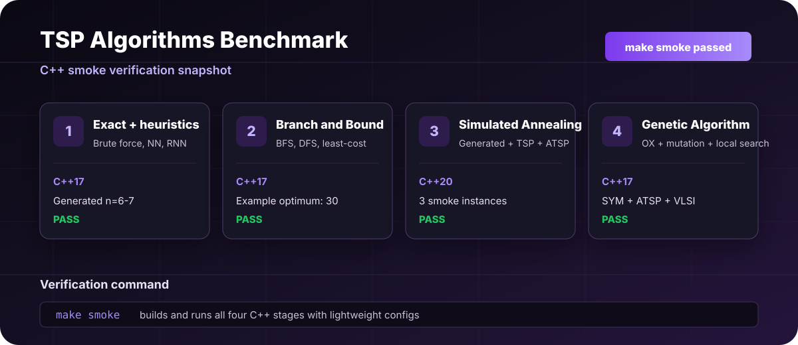
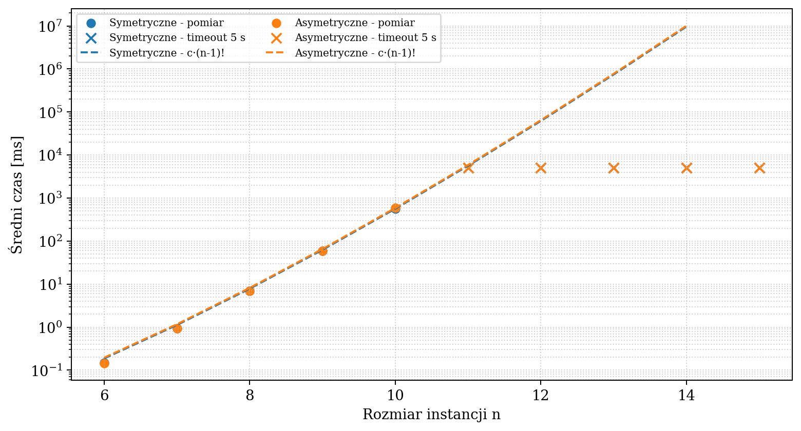
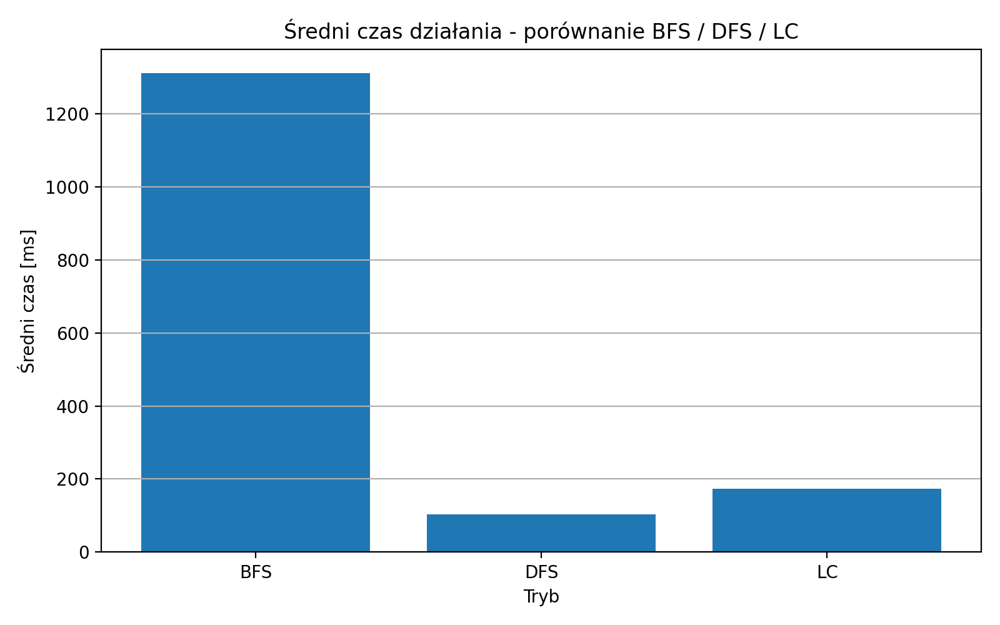
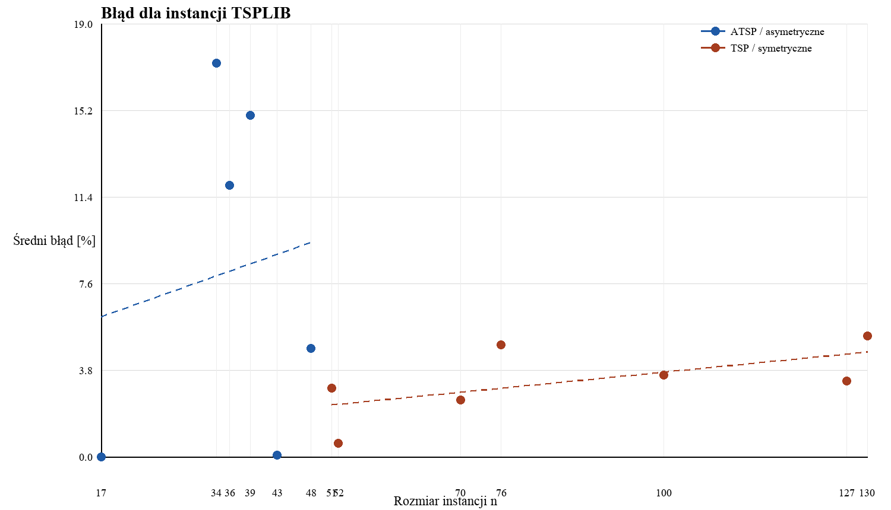
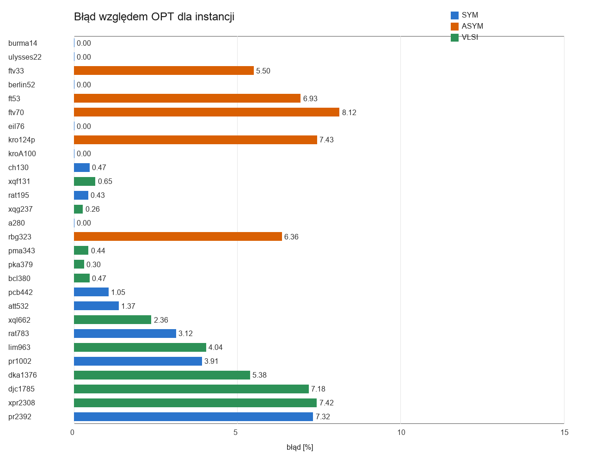

<div align="center">

# TSP Algorithms Benchmark

**Four-stage benchmark of exact algorithms, heuristics and metaheuristics for symmetric and asymmetric Travelling Salesman Problem instances.**

<p>
  
  
  
  
</p>

<p>
  <a href="#quick-start">Quick start</a> ·
  <a href="#project-scope">Project scope</a> ·
  <a href="#verification">Verification</a> ·
  <a href="#results-snapshot">Results</a> ·
  <a href="docs/PROJECT_DOCUMENTATION_PL.md">Polish docs</a>
</p>



</div>

## About

This repository is a refreshed academic project for the Design and Analysis of Algorithms course. It compares several approaches to the Travelling Salesman Problem across four stages: brute force and constructive heuristics, Branch and Bound, Simulated Annealing, and a Genetic Algorithm with local improvement. All core benchmark programs are implemented in C++.

The original coursework has been reorganized into a GitHub-ready portfolio repository with clean stage folders, reproducible configs, CSV results, plots and Polish documentation.

## Project Scope

| Stage | Area | Implementation |
| --- | --- | --- |
| `stage1_exact_heuristics` | Baseline algorithms | C++ brute force, random search, nearest neighbor and repetitive nearest neighbor. |
| `stage2_branch_and_bound` | Exact search variants | C++ Branch and Bound with BFS, DFS and least-cost OPEN ordering. |
| `stage3_simulated_annealing` | Metaheuristic search | C++ Simulated Annealing with TSPLIB, ATSP and generated-instance loaders. |
| `stage4_genetic_algorithm` | Larger benchmarks | C++ Genetic Algorithm with OX crossover, tournament selection, mutation and local search. |

## What It Shows

| Area | Details |
| --- | --- |
| Algorithmic comparison | Exact methods, heuristics and metaheuristics are tested under one project structure. |
| Input handling | Simple matrices, generated complete graphs, TSPLIB TSP, TSPLIB ATSP and Waterloo VLSI-style instances. |
| Measurement | Runtime, tour length, relative error, search-tree statistics, generation counts and group summaries. |
| Reproducibility | Text configs and fixed seeds are included for each stage. |
| Reporting | CSV outputs, charts and original academic PDF reports are included in `docs/reports/`. |

## Tech Stack

| Layer | Tools |
| --- | --- |
| Languages | C++17/C++20 |
| Algorithms | Brute force, RAND, NN, RNN, Branch and Bound, Held-Karp reference, SA, GA |
| Data | Generated matrices, TSPLIB, ATSP, Waterloo VLSI instances |
| Output | CSV, PNG plots, PDF reports |
| Tooling | Makefile, CSV outputs and included plots/reports |

## Quick Start

Clone the repository and list available commands:

```bash
make help
```

Run a quick exact-search example:

```bash
make stage2
```

Run quick checks for all four C++ stages:

```bash
make smoke
```

Build the C++ stages:

```bash
make stage1-build
make stage2-build
make stage3-build
make stage4-build
```

Run selected experiments:

```bash
make stage1-heuristics
make stage3-generated
make stage4-run
```

## Verification

The repository includes lightweight smoke configurations for every C++ stage. `make smoke` builds all four programs and runs small representative cases for exact search, Branch and Bound, Simulated Annealing and the Genetic Algorithm.

Detailed testing notes are available in [Polish testing documentation](docs/TESTING_PL.md).

## Results Snapshot

| Experiment | Output |
| --- | --- |
| C++ smoke verification |  |
| Stage 1 brute force scaling |  |
| Stage 2 Branch and Bound time |  |
| Stage 3 SA relative error |  |
| Stage 4 GA gap by instance |  |

## Repository Structure

```text
tsp-algorithms-benchmark/
├── docs/
│   ├── PROJECT_DOCUMENTATION_PL.md
│   ├── GITHUB_PUBLISHING_PL.md
│   ├── TESTING_PL.md
│   ├── assets/
│   └── reports/
├── stage1_exact_heuristics/
├── stage2_branch_and_bound/
├── stage3_simulated_annealing/
├── stage4_genetic_algorithm/
├── Makefile
└── README.md
```

## Documentation

- [Project documentation in Polish](docs/PROJECT_DOCUMENTATION_PL.md)
- [Testing documentation in Polish](docs/TESTING_PL.md)

## Future Improvements

- Add automated smoke tests for all stages.
- Normalize the input loader into a shared library.
- Add GitHub Actions for C++ builds and smoke tests.
- Export all benchmark summaries into one combined dashboard.
